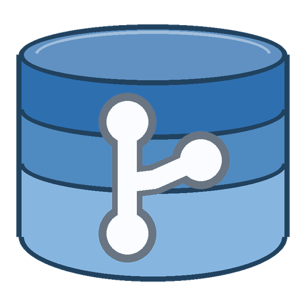
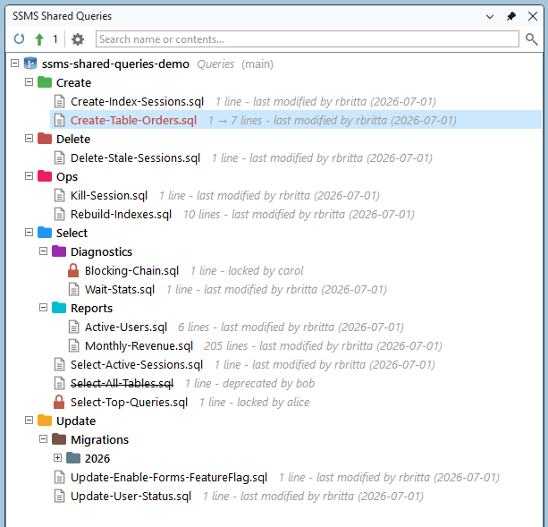
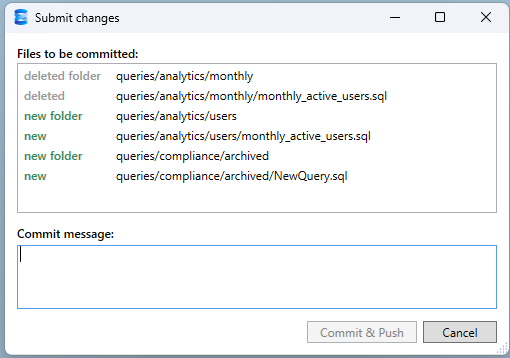
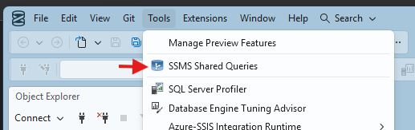

<div align="center">



# SSMS Shared Queries

**A shared, git-backed library of SQL queries, right inside SQL Server Management Studio.**

[](https://github.com/rbritta/ssms-shared-queries/actions/workflows/build.yml)
[](https://github.com/rbritta/ssms-shared-queries/releases/latest)
[](https://github.com/rbritta/ssms-shared-queries/releases)
[](LICENSE)

</div>

---

Your team's best queries usually live scattered across desktops, chat history, and
one teammate's `Documents\SQL` folder. **SSMS Shared Queries** turns them into a
single, versioned library docked next to Object Explorer. Behind the scenes it is
an ordinary **git repository**, but git is **invisible**: the panel clones, pulls,
commits, and pushes for you. Every change is recorded **in its author's name**, so
the history doubles as a per-person audit trail.

## What it looks like

<div align="center">



</div>

Folders carry team-shared colors; a new or moved query shows in red with a live
line count; locked queries show a padlock and "locked by ..."; deprecated queries
are struck through; and each file shows its last author from git. The toolbar's
**Sync** pulls the latest and **Submit** (with its pending-change count) commits and
pushes in your name. The panel above shows a small sample query library.

**Submit** lists exactly what will change in plain language - color-coded
new / modified / deleted / renamed, with whole folders rolled up - then asks for a
commit message:

<div align="center">



</div>

## Features

| | |
|---|---|
| **Object-Explorer-style tree** | Folders and `.sql` files, docked on the right, with `+`/`-` expanders. |
| **Sync / Submit** | Pull the latest, or commit + push with a readable change list and a message. Conflicts get a plain keep-mine / take-theirs prompt. Syncs automatically on open and after you change settings; a spinning-gear "Syncing..." overlay shows while it runs, and a setup prompt (not an error) appears until it is configured. |
| **Open & edit** | Double-click (or right-click > Open) to open a query in the SSMS editor; edits show red with a live line-count delta. |
| **Insert at cursor** | Right-click > Insert into editor to drop a query at the cursor of the active window. |
| **Search** | One search over file names and contents: name matches highlight the letters, content matches turn the file icon blue. Inline clear (X) in the box. |
| **Favorites** | Per-user stars, grouped at the top. |
| **Folder colors** | Shared via the repo and inherited by new subfolders. |
| **Locks & deprecation** | Advisory locks and a strike-through "deprecated" mark, both shared with the team. |
| **Drag-and-drop, rename, new** | Move files/folders, inline rename (F2), new file / new folder. |
| **Safe Discard** | Throws away only the uncommitted part of a file; never deletes a submitted query. |
| **Info & history** | Per-file creator / last author / recent commits, plus a capped local operation log. |
| **Reveal** | Right-click a folder > _Open in File Explorer_. |
| **AI collaboration** | An auto-managed `CLAUDE.md` (+ `AGENTS.md`) in the queries folder tells any AI assistant to improve queries locally while you stay the one who Submits. Right-click the repo node > _Edit AI rules_. See [docs/AI-COLLABORATION.md](docs/AI-COLLABORATION.md). |

## Quick start

**1. Install** (PowerShell, no clone or build needed - downloads the latest release and installs per-machine):

```powershell
irm https://raw.githubusercontent.com/rbritta/ssms-shared-queries/main/install.ps1 -OutFile "$env:TEMP\sq.ps1"; & "$env:TEMP\sq.ps1"
```

It self-elevates for the one-time copy, then registers the extension. (Prefer to do
it by hand? See [Install](#install) below.)

**2. Point it at a repo:** start SSMS, open **Tools > Options > SSMS Shared Queries**,
and set the *Repository URL* (HTTPS), *Branch* (default `main`), and *Queries folder*
(default `queries`).

**3. Use it:** open **Tools > SSMS Shared Queries**, click **Sync**, and you are live.

<div align="center">



</div>

## Requirements

- **SSMS 22** (64-bit).
- **[Git for Windows](https://git-scm.com/download/win)** - provides `git.exe` and
  Git Credential Manager (used for the one-time login).

## How it works

- **Login once.** The first push opens a browser login for **GitHub** or **Azure
  DevOps** via Git Credential Manager; the credential is cached in Windows
  Credential Manager. No tokens are stored by this extension.
- **Attribution.** The commit author comes from your `git config user.name` /
  `user.email`, so the repo history is a real per-person trail.
- **Storage.** Each repository is cloned into its own subfolder under
  `%LocalAppData%\SsmsSharedQueries\repo`, so pointing the extension at a different
  Repository URL keeps the previous clone; per-user preferences (favorites, expand
  state, history) sit alongside the cache.
- **Transport.** The extension shells out to `git.exe` - there is no in-process
  native git, and no console window ever appears.
- **Shared metadata.** Folder colors, locks, and deprecated marks live in a hidden
  `.ssq` file committed inside each folder, so the whole team sees them. See
  [docs/ARCHITECTURE.md](docs/ARCHITECTURE.md).

## Important considerations

- **Everyone shares one branch.** Every member can read, edit, rename, and delete
  any query, and Submit pushes straight to the shared branch - there is no review
  gate by default. The git history (in each author's name) is both the audit trail
  and the undo: nothing is truly lost, but treat the library as a trusted-team
  space. A protected-branch / Pull Request flow is on the roadmap.
- **Locks are advisory.** A lock disables Open / Rename / Delete / move in the UI
  and signals "I am working on this". It does not stop someone editing through git
  directly, and anyone can unlock. It is etiquette, not enforcement.
- **`.ssq` and `.sql` are committed plain text** shared with the whole team. Never
  put secrets (passwords, connection strings, tokens) in a query or its metadata.
- **Conflicts are resolved by choice, not auto-merge.** If a file changed on the
  server and clashes with yours, Submit asks you to keep yours or take the server's,
  and your work stays committed locally until you decide.
- **No telemetry.** The only network traffic is git talking to your own repository.

> **Support note.** Microsoft does **not** officially support third-party
> extensions in SSMS 21/22. They load, but in an unsupported configuration that can
> break on an SSMS update. For a regulated or B2B context, get security/compliance
> sign-off before adopting it. This is not legal or compliance advice.

## Install

The quick-start one-liner is the easy path. To do it by hand:

1. Download `SsmsSharedQueries.vsix` from [Releases](https://github.com/rbritta/ssms-shared-queries/releases/latest).
2. Close SSMS.
3. Run `.\install.ps1` from a clone (it uses your local build if present, otherwise
   downloads the latest release), **or** copy the extracted VSIX into
   `...\Microsoft SQL Server Management Studio 22\Release\Common7\IDE\Extensions\`
   and run `SSMS.exe /updateconfiguration`.
4. Start SSMS and open **Tools > SSMS Shared Queries**.

<details>
<summary>Why per-machine (not per-user)?</summary>

SSMS 22 only merges the `pkgdef` of extensions installed under the **product
folder**. An extension dropped in the per-user folder
(`%LocalAppData%\Microsoft\SSMS\<ver>\Extensions\`) is listed in the catalog but its
`pkgdef` is never merged, so the package never registers (no Options page, no menu,
it never loads). Installing per-machine + `/updateconfiguration` is what makes it
load.

</details>

## Distribution and updates

There is no official Microsoft marketplace for SSMS extensions (they are
unsupported, and the Visual Studio Marketplace targets Visual Studio, not SSMS). So
this project ships the way capable SSMS tools do:

- **GitHub Releases** - every `vX.Y.Z` tag is built by CI and published with the
  `.vsix` attached. This is the source of truth.
- **One-command install** - the quick-start line downloads that release and installs
  it, so end users never clone or build.
- **Private gallery (optional, for teams)** - Visual-Studio-shell tools can also be
  served from a self-hosted *extension gallery* (an Atom feed, hostable on GitHub
  Pages) registered under `Tools > Options > Environment > Extensions`, which adds
  in-product install and update notifications. It is reliable in Visual Studio;
  whether SSMS 22's trimmed shell surfaces the gallery UI varies, so treat it as a
  bonus. Setup guide: [docs/GALLERY.md](docs/GALLERY.md).

## Shared repository layout

The shared repo just needs a folder of `.sql` files:

```text
queries/
  compliance/
    monthly_report.sql
  ops/
    daily_health_check.sql
```

## Build from source

Contributors need [VS Build Tools 2022](https://visualstudio.microsoft.com/downloads/)
with the *.NET desktop build tools* workload. The VSIX build targets come from
NuGet, so the full VS extension workload is not required.

```powershell
.\build.ps1                                  # -> src\SsmsSharedQueries\bin\Release\SsmsSharedQueries.vsix
dotnet test tests\SsmsSharedQueries.Tests    # 155 unit tests
```

See [CONTRIBUTING.md](CONTRIBUTING.md) for the version-bump and testing details, and
[docs/ARCHITECTURE.md](docs/ARCHITECTURE.md) for how the pieces fit together.

## Project layout

```text
SsmsSharedQueries.sln
build.ps1 / install.ps1
src/SsmsSharedQueries/             classic VSPackage, net472, amd64
  SharedQueriesPackage.cs            AsyncPackage: command + tool window + options
  UI/QueryPanelControl.cs            the code-built WPF panel
  UI/FolderMeta.cs                   the shared .ssq metadata (color/lock/deprecated)
  UI/QueryPaths.cs, RowStatus.cs     pure helpers (unit-tested)
  Git/GitService.cs                  clone/pull/commit/push via git.exe
  Git/GitStatusParser.cs             pure porcelain/log parsing (unit-tested)
  Editor/SqlEditorService.cs         read/insert into the active SQL editor
tests/SsmsSharedQueries.Tests/     xUnit, links the pure logic (no VS SDK)
```

## Roadmap

- Split the WPF panel into smaller collaborators (the parsing / path / row logic is
  already extracted and tested).
- Per-host identity bootstrap (set `user.name` / `user.email` on first Sync).
- Optional protected-branch / Pull Request mode for governed environments.

## Contributing

Issues and pull requests are welcome. Please read [CONTRIBUTING.md](CONTRIBUTING.md)
and the [Code of Conduct](CODE_OF_CONDUCT.md) first. Found a security issue? See
[SECURITY.md](SECURITY.md).

## License

[MIT](LICENSE) (c) 2026 SSMS Shared Queries contributors.
